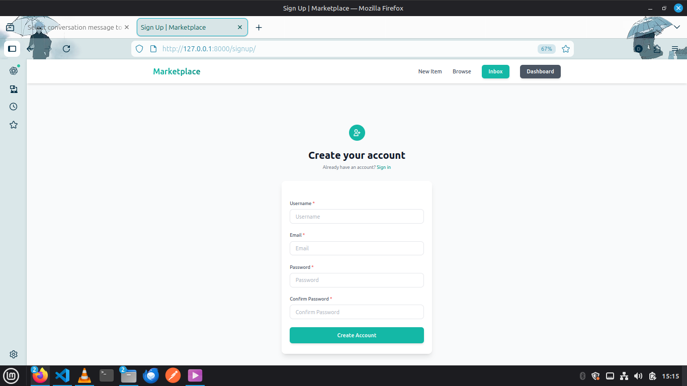
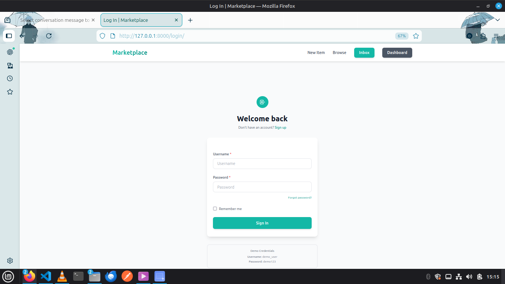
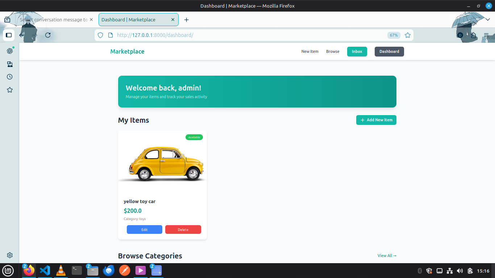
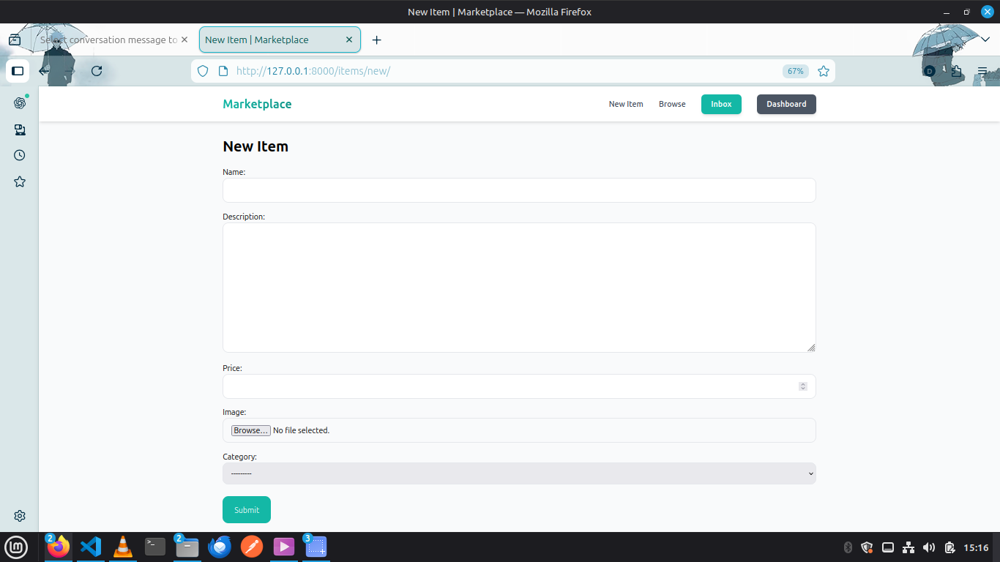
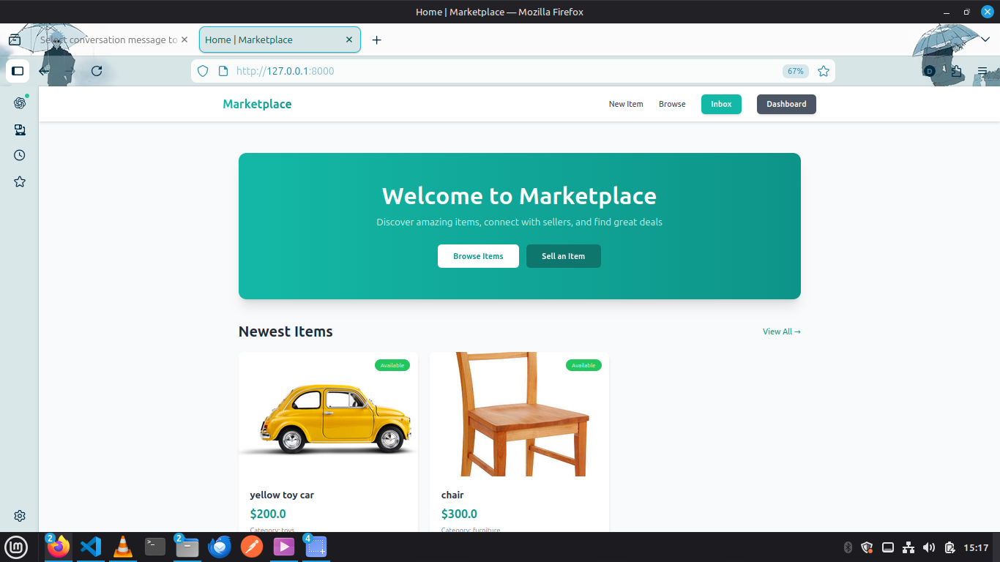
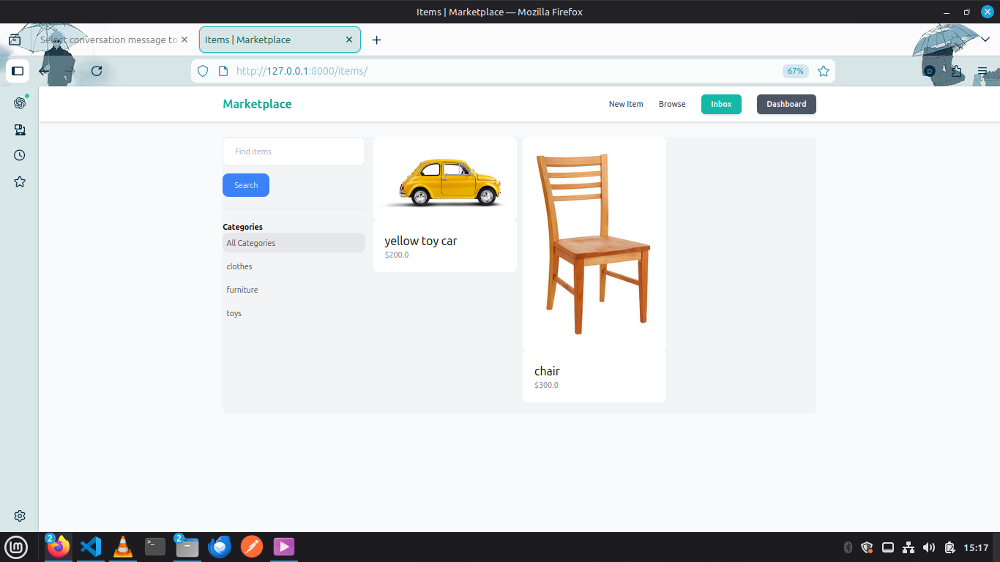
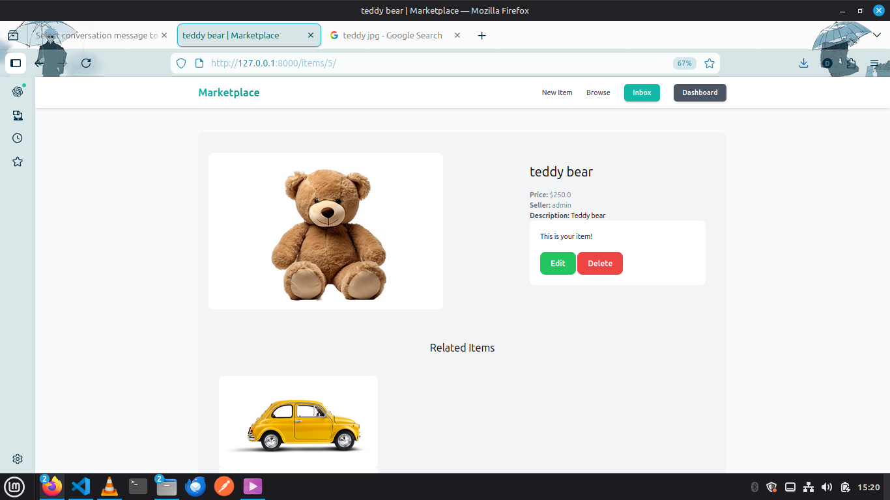
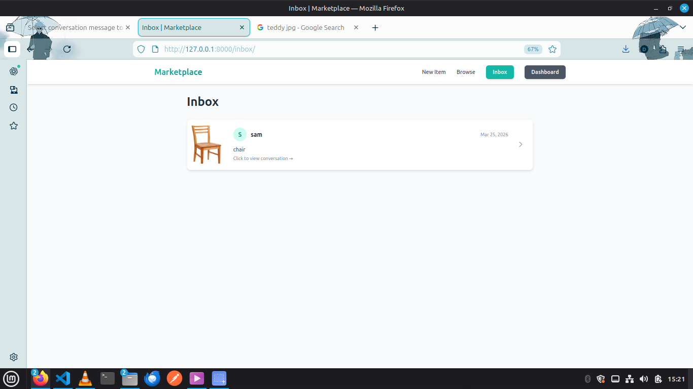
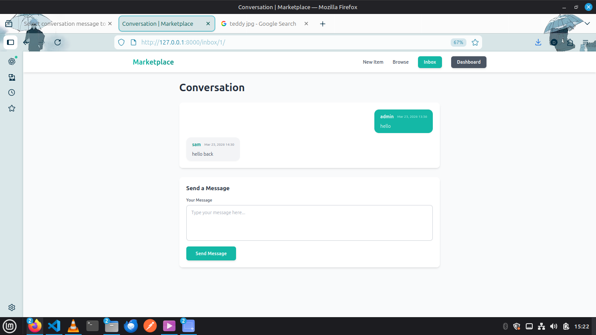

# Marketplace - Django E-commerce Platform

A full-featured marketplace web application built with Django that allows users to buy, sell, and communicate with each other.

## Set Up and Useful Commands

Python3 -m venv env

source /env/bin/activate

pip install django

django-admin startproject (project_name) .

python manage.py runserver

python manage.py startapp (appname eg core)

## Features

### User Authentication

- User registration and login
- Secure password management
- Profile-based access control

### Item Management

- Create, edit, and delete items
- Upload images for items
- Set prices and descriptions
- Mark items as sold/unavailable
- Categorize items for better organization

### Browsing & Search

- Browse items by category
- Search items by name or description
- Filter items by various criteria
- View detailed item information

### Messaging System

- Start conversations about items
- Real-time messaging between buyers and sellers
- View conversation history
- User-to-user communication

### Dashboard

- Personal dashboard for users
- View your listed items
- Track conversations
- Manage your profile

## Technology Stack

- **Backend**: Django 6.0.3
- **Frontend**: HTML, Tailwind CSS
- **Database**: SQLite (development) / PostgreSQL (production ready)
- **Authentication**: Django's built-in auth system

## Installation

### Prerequisites

- Python 3.12 or higher
- pip (Python package manager)
- Virtual environment (recommended)

## Quick Start

# Clone repository

git clone (repo url)
cd marketplace

# Create and activate virtual environment

python -m venv env
source env/bin/activate # On Windows: env\Scripts\activate

# Install dependencies

pip install -r requirements.txt

# Setup database

python manage.py migrate
python manage.py createsuperuser

# Run server

python manage.py runserver

---

## Structure

marketplace/
│
├── manage.py
├── requirements.txt
├── db.sqlite3
│
├── marketplace/ # Project configuration
│ ├── **init**.py
│ ├── settings.py
│ ├── urls.py
│ └── wsgi.py
│
├── core/ # Core app (homepage, auth)
│ ├── migrations/
│ ├── templates/
│ │ └── core/
│ │ ├── base.html
│ │ ├── index.html
│ │ ├── login.html
│ │ ├── signup.html
│ │ ├── contact.html
│ │ ├── products.html
│ │ └── services.html
│ ├── **init**.py
│ ├── admin.py
│ ├── forms.py # LoginForm, SignUpForm
│ ├── models.py
│ ├── urls.py
│ └── views.py # index, contact, products, services, signup
│
├── item/ # Item management app
│ ├── migrations/
│ ├── templates/
│ │ └── item/
│ │ ├── detail.html
│ │ ├── form.html
│ │ └── items.html
│ ├── **init**.py
│ ├── admin.py
│ ├── forms.py # NewItemForm, EditItemForm
│ ├── models.py # item, Category
│ ├── urls.py
│ └── views.py # items, detail, new, edit, delete
│
├── conversation/ # Messaging app
│ ├── migrations/
│ ├── templates/
│ │ └── conversation/
│ │ ├── new.html
│ │ └── detail.html
│ ├── **init**.py
│ ├── admin.py
│ ├── forms.py # ConversationMessageForm
│ ├── models.py # Conversation, ConversationMessage
│ ├── urls.py
│ └── views.py # new_conversation, inbox, detail
│
├── dashboard/ # User dashboard app
│ ├── migrations/
│ ├── templates/
│ │ └── dashboard/
│ │ └── index.html
│ ├── **init**.py
│ ├── admin.py
│ ├── models.py
│ ├── urls.py
│ └── views.py # index
│
├── media/ # User uploaded images
│ └── item_images/
│
└── static/ # Static files (CSS, JS)

